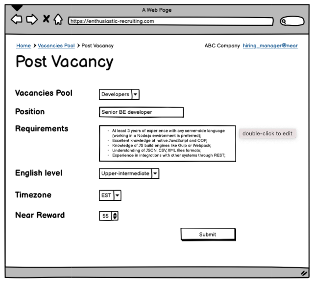
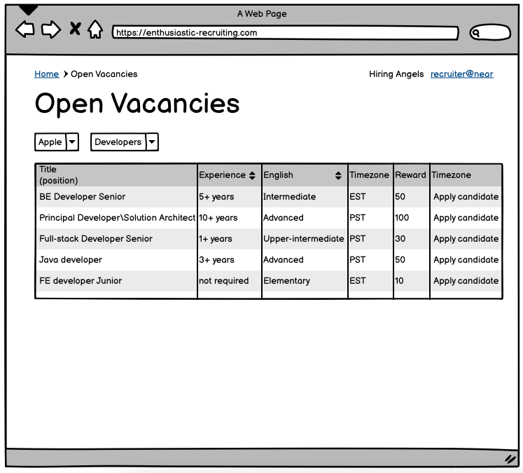
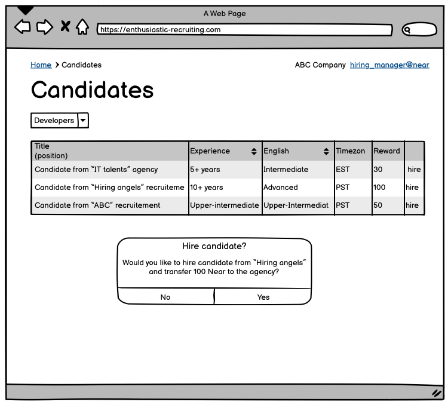

# Enthusiastic recruitment
_"Good candidates are always near"_

A smart contract developed to provide functionality for a trustworthy recruitment process with the help of Near protocol smart contracts. 

## Problem

The hiring of IT talents is one of the most challenging domains for recruiters. Quite often recruitment agencies face issues connected with the dishonest behavior of companies hiring managers, at the same time companies devote huge budgets to the external recruiters not getting the expected results.

## Solution
Create a decentralized application based on the Near Protocol to establish a reliable interface for the hiring managers' and recruitment agencies' interactions.

### Users journey

1. IT company "Bug makers" wants to hire a strong Senior dev for their needs.
2. Hiring manager Jason posts vacancy, provides position requirements, and deposits a reward for the recruitment agency (e.g. 50 Near)
3. "Hiring Angels" agency assign a recruiter Laura to work on "Bug makers"'s vacancies pool
4. Laura checks the list of the open vacancies and start looking for available candidates on the market
5. As soon as a candidate is found by Laura, she applies them for a vacancy
6. Jason see a new depersonalized candidate on the candidates list. There is all needed info except name and contact data.
7. Jason checks if the candidate profile suits the requirements and if so clicks "hire"
8. Contact information of the candidate is automatically sent to Jason and appears on the Hired Candidates list
9. Reward for the candidates is sent to Laura's Near account
10. Laura and Jason are happy (at least I hope so)

- [Installation](#installation)
- [UX Wireframes](#ux-wireframes)
- [Contract](#contract)
- [Deploying](#deploying)
- [Future Development](#future-development)

---

## Installation

1. clone this repo
2. run `yarn install` (or `npm install`)
3. run `export CONTRACT=<ACCOUNT_TO_DEPLOY>`
4. run `./scripts/recruitement-deploy.sh` 

## UX Wireframes

All UX wireframes can be found in the `wireframes/` folder. 
Wireframes of the core pages are presented below.
 
**Post a Vacancy**

_Hiring manager Jason posts vacancy, provids position requirements and deposit a reward for the recruitment agency (e.g. 50 Near)_

**Get list of posted vacncies**

_Laura checks the list of the open vacancies and start looking for available candidates_

**Apply candidate**

_As soon as a candidate found Laura applies them to a vacancy_

**Hire candidate**

_Jason see a new depersonalized candidate in the candidates list_
_If the candidate suits requirements and he clicks "hire"_
_Contact information of the candidate is sent to Jason and appear in the Hired Candidates list_
_Reward for the candidates is sent to Laura Near account_

## Contract

Contract is represented by two primary entities: Vacancy and Candidate. 
Instance of Vacancy is created by a hiring managers and keep details about this entity:
- Position requirements
- Reward that company is ready to pay to a recruitement agency

Instance of Candidate is created by a recruiter and keep the following details:
- Candidate experience
- Timezone
- English level
- Salary expectations
