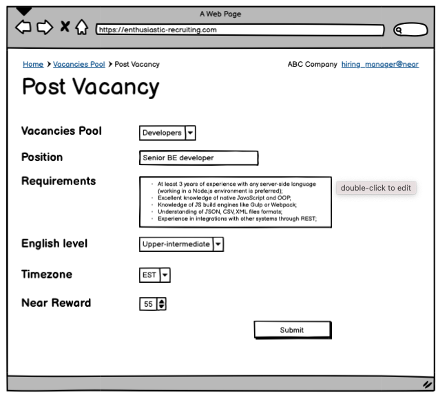
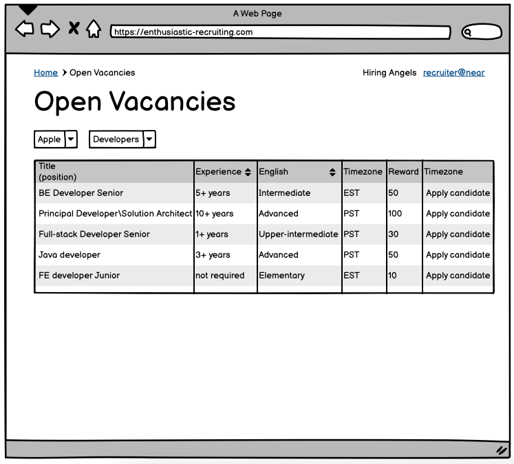
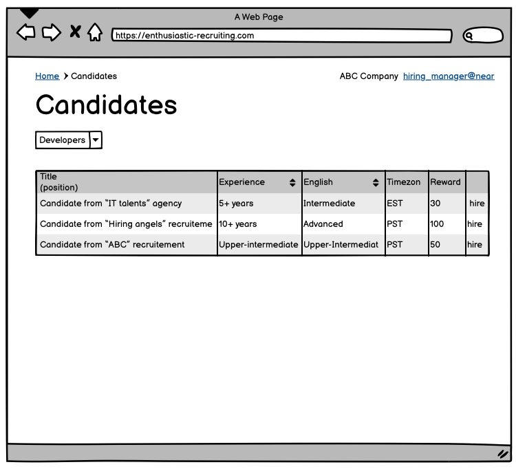
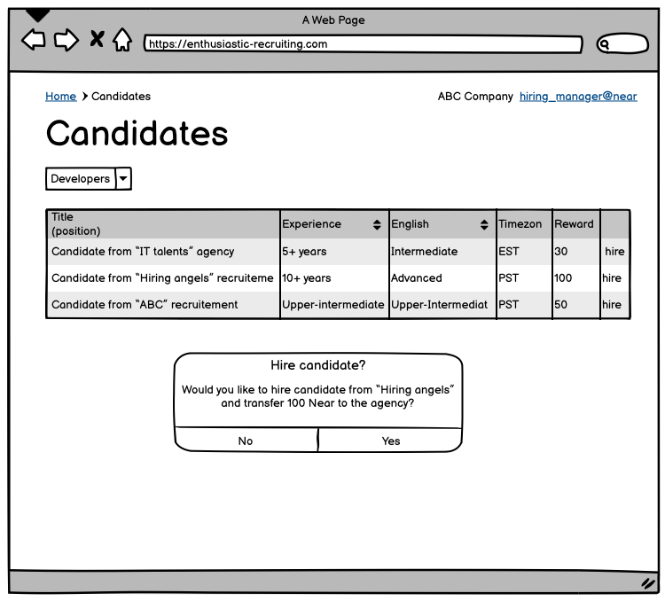

# Enthusiastic recruitment
"Good candidates are always near"

A smart contract developed to provide functionality for a trustworthy recruitment process with the help of Near protocol smart contracts. 

## Problem

The hiring of IT talents is one of the most challenging domains for recruiters. Quite often recruitment agencies face issues connected with the dishonest behavior of companies hiring managers, at the same time companies devote huge budgets to the external recruiters not getting the expected results.

## Solution
Create a decentralized application to provide a reliable interface for the hiring managers - recruitmenmt agencies interactions.
Near smart contract is going to be used for that.

### Users journey

1. IT company "Bug makers" wants to hire a strong Senior dev for their needs.
2. Hiring manager Jason posts vacancy, provids position requirements and deposit a reward for the recruitment agency (e.g. 50 Near)
3. "Hiring Angels" agency assign a recruiter Laura to work on "Bug makers"'s vacancies pool
4. Laura checks the list of the open vacancies and start looking for available candidates
5. As soon as a candidate found Laura applies them to a vacancy
6. Jason see a new depersonalized candidate in the candidates list
7. Jason checks information if the candidate suits requirements and if so click "hire"
8. Contact information of the candidate is sent to Jason and appear in the Hired Candidates list
9. Reward for the candidates is sent to Laura Near account
10. Laura and Jason are happy (at least I hope so)


- [Installation](#installation)
  - [Commands](#commands)
  - [Who This Is For](#who-this-is-for)
- [UI Wireframes](#ui-wireframes)
- [File Structure](#file-structure)
- [Contracts](#contracts)
  - [Proposal](#proposal)
  - [Project](#project)
  - [Factory](#factory)
- [Deploying](#deploying)
- [Contributing](#contributing)
  - [Future Development](#future-development)
  - [Key Contributors](#key-contributors)

---

## Installation

1. clone this repo
2. run `yarn install` (or `npm install`)
3. run `yarn build` (or `npm run build`)


### Commands

**Compile source to WebAssembly**

```sh
yarn build                    # asb --target debug
yarn build:release            # asb
```

**Run unit tests**

```sh
yarn test:unit                # asp --verbose --nologo -f unit.spec
```

**Run simulation tests**

These tests can be run from within VSCode (or any Rust-compatible IDE) or from the command line.

_NOTE: Rust is required_

```sh
yarn test:simulate            # yarn build:release && cargo test -- --nocapture
```

**Run all tests**

```sh
yarn test                     # yarn test:unit && test:simulate
```

## UX Wireframes

All UX wireframes can be found in the `wireframes/` folder. 
Wireframes of the core pages are presented below.
 
**Post a Vacancy**
_Hiring manager Jason posts vacancy, provids position requirements and deposit a reward for the recruitment agency (e.g. 50 Near)_



**Get list of posted vacncies**

_Laura checks the list of the open vacancies and start looking for available candidates_



**Apply candidate**
_As soon as a candidate found Laura applies them to a vacancy_


**Get list of applied candidates**
_Jason see a new depersonalized candidate in the candidates list_
_Jason checks information if the candidate suits requirements and if so click "hire"_



**Hire candidate**
_Contact information of the candidate is sent to Jason and appear in the Hired Candidates list_
_Reward for the candidates is sent to Laura Near account_



## Recruitement contract

Contract is represented by two primary classes Vacancy and Candidate. 
Vacancy is created by a hiring managers and keep details about this entity:
- Position requirements
- Reward that company is ready to pay to a recruitement agency

Candidate is created by a recruiter and keep the following details:
- Candidate experience
- Timezone
- English level
- Salary expectations

## Deploying
